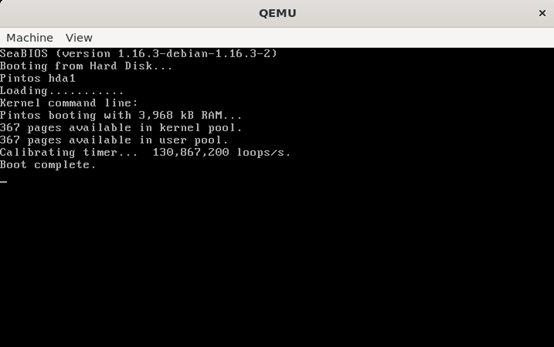
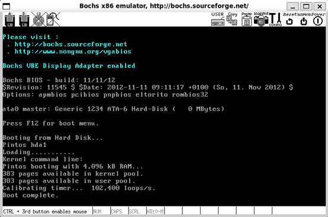
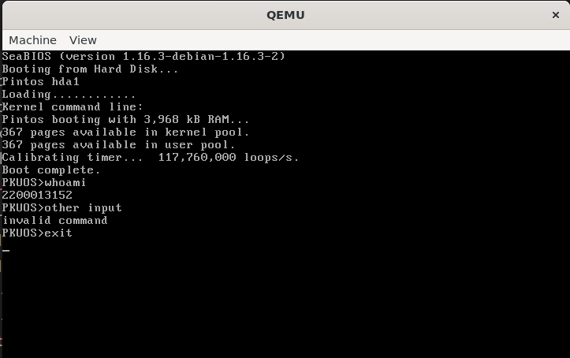

# Project 0: Getting Real

## Preliminaries

>Fill in your name and email address.

Ziyang Xu <2200013152@stu.pku.edu.cn>

>If you have any preliminary comments on your submission, notes for the TAs, please give them here.

>Please cite any offline or online sources you consulted while preparing your submission, other than the Pintos documentation, course text, lecture notes, and course staff.

## Booting Pintos

>A1: Put the screenshot of Pintos running example here.

## Debugging

#### QUESTIONS: BIOS 

>B1: What is the first instruction that gets executed?

ljmp    $0x3630, $0xf000e05b

>B2: At which physical address is this instruction located?

0xffff0

#### QUESTIONS: BOOTLOADER

>B3: How does the bootloader read disk sectors? In particular, what BIOS interrupt is used?

Set ES = 0x2000 + 0x20 * n, BX = n, and AH = 0x42. After that, make an interruption to read the disk sectors to given memory address. Finally, loop these operations to read all sectors of kernel.

The interrupt 0x14 is used.

>B4: How does the bootloader decides whether it successfully finds the Pintos kernel?

By checking the partition. In details, it checks whether the 446th (which is 510 - 64) byte is 0x80 to make sure the partition is bootable, and whether the 470th byte is 0x20 to make sure it is a Pintos kernel partition.

>B5: What happens when the bootloader could not find the Pintos kernel?

Increment 16 bytes and check again, until the bootloader find the Pintos kernel, or realize that Pintos kernel doesn't exist in current drive. Then it will go to the next drive (hard disk 0 -> 1), then repeat until no more drives.

>B6: At what point and how exactly does the bootloader transfer control to the Pintos kernel?

When bootloader finished loading kernel into memory, it prepares and do a ljmp, and jumps into kernel, transferring control to it.

#### QUESTIONS: KERNEL

>B7: At the entry of pintos_init(), what is the value of expression `init_page_dir[pd_no(ptov(0))]` in hexadecimal format?

0x0

>B8: When `palloc_get_page()` is called for the first time,

>> B8.1 what does the call stack look like?
>>
> 0. palloc_get_page()
> 1. paging_init()
> 2. pintos_init()
> 3. start()

>> B8.2 what is the return value in hexadecimal format?
>>
> 0xc0101000

>> B8.3 what is the value of expression `init_page_dir[pd_no(ptov(0))]` in hexadecimal format?
>>
> 0x0 

>B9: When palloc_get_page() is called for the third time,

>> B9.1 what does the call stack look like?
>>
> 0. palloc_get_page()
> 1. thread_create()
> 2. thread_start()
> 3. pintos_init()
> 4. start()

>> B9.2 what is the return value in hexadecimal format?
>>
> 0xc0103000

>> B9.3 what is the value of expression `init_page_dir[pd_no(ptov(0))]` in hexadecimal format?
>>
>> 0x102027

## Kernel Monitor

>C1: Put the screenshot of your kernel monitor running example here. (It should show how your kernel shell respond to `whoami`, `exit`, and `other input`.)

#### 

>C2: Explain how you read and write to the console for the kernel monitor.

Read:  input_getc() in a infinite loop, if input is not `Enter`, then write it immediately, and save it to a buffer at the same time.

Write: Use printf to print the input char; if input is `Enter`, then print `\n` and work according to the whole input.