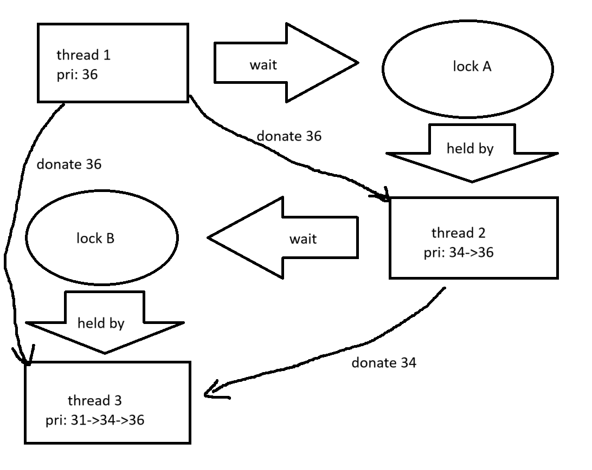

# Project 1: Threads

## Preliminaries

>Fill in your name and email address.

徐子扬 <2200013152@stu.pku.edu.cn>

>If you have any preliminary comments on your submission, notes for the
>TAs, please give them here.


>Please cite any offline or online sources you consulted while
>preparing your submission, other than the Pintos documentation, course
>text, lecture notes, and course staff.

xv6-riscv <https://github.com/mit-pdos/xv6-riscv> (仅参考与寻找灵感用)

## Alarm Clock

#### DATA STRUCTURES

>A1: Copy here the declaration of each new or changed struct or struct member, global or static variable, typedef, or enumeration.  Identify the purpose of each in 25 words or less.

全局变量`sleep_list`是所有休眠线程的list，按照苏醒时间排序。

```c
static struct list sleep_list;  
```

向`struct thread`添加的：
```c
  int64_t wake_time;    /* 记录应当苏醒的tick */
```

#### ALGORITHMS

>A2: Briefly describe what happens in a call to timer_sleep(),
>including the effects of the timer interrupt handler.

若ticks <= 0，则直接返回。

否则，先禁用中断，再调用`thread_sleep()`，为当前线程标记`wake_time`，并按照苏醒时间将当前线程加入`sleep_list`，最后block当前线程。

在时钟中断处理函数中，不断检查list开头的线程是否符合苏醒条件，不符合则后面的所有线程一定不符合，直接结束；否则unblock该线程并从list中删除它。

>A3: What steps are taken to minimize the amount of time spent in
>the timer interrupt handler?

通过函数`list_insert_ordered()`维护一个按照苏醒时间有序的列表，这样在中断处理函数中，只需要检查列表开头而不是整个列表。

#### SYNCHRONIZATION

>A4: How are race conditions avoided when multiple threads call
>timer_sleep() simultaneously?

在函数开头禁用中断，在最后恢复。

>A5: How are race conditions avoided when a timer interrupt occurs
>during a call to timer_sleep()?

由于中断被禁用了，在此过程中不会发生中断，也就不会因此发生race。

#### RATIONALE

>A6: Why did you choose this design?  In what ways is it superior to
>another design you considered?

最初我采用的是朴素的检查所有列表元素的方式，但是我认为这样效率比较低，尤其是在时钟中断处理函数中停留时间过长，这样对后续MLFQS也有较大的影响，因此我换用了现在的方式。现在的方式相对而言在时钟中断处理函数中花费的时间较少，我认为这种方式较好。

## Priority Scheduling

#### DATA STRUCTURES

>B1: Copy here the declaration of each new or changed struct or struct member, global or static variable, typedef, or enumeration.  Identify the purpose of each in 25 words or less.

向`struct thread`添加的：

```c
  uint8_t donate;   /* 当前线程被donate的次数 */
  int8_t priority_restore;   /* 当结束donation时应当恢复的priority */
  struct lock *waiting;   /* 当前进程等待的锁，没有则为NULL */
```

向`struct lock`添加的：

```c
  int origin_priority;   /* 被donate线程原本的priority */
  int donate_priority;   /* 当前lock上donation的priority */
```

>B2: Explain the data structure used to track priority donation.
>Use ASCII art to diagram a nested donation.  (Alternately, submit a
>.png file.)

参见B1。

**donate**

主要用于辅助检查当前线程是否被donate，以便在所有donation完成时恢复其他变量。

**priority_restore**

当前线程被多次donate（持有多个锁），先释放donate较小priority的锁时，不能直接恢复priority，只能将`priority_restore`更新成该锁释放后线程本应恢复的priority；之后释放donate最高priority的锁时，不能将priority简单设为该锁记录的原priority，而是与`priority_restore`之间的较小值。

**waiting**

主要的作用是通过这个锁追溯到它的持有者，在不断追溯的过程中实现nested donation。

**origin_priority**

主要用于记录donate之前holder线程的priority，这个值直到锁的holder更换之前，最多设置一次，始终记录最初的priority，尽管在同一lock上可能发生多次donation。

**donate_priority**

主要记录与当前lock相关的donation中，donate的priority。当存在别的锁发生donation时，线程的priority可能设为更高的值，但是这个值并不改变，可以用于判断当前的锁是上面*priority_restore*部分中提到的两种之中的哪一种。

**Nested Donation**



#### ALGORITHMS

>B3: How do you ensure that the highest priority thread waiting for
>a lock, semaphore, or condition variable wakes up first?

选择要唤醒的线程之前，将`waiters`按照priority高低的顺序排序，然后pop其中priority最高的线程。

>B4: Describe the sequence of events when a call to lock_acquire()
>causes a priority donation.  How is nested donation handled?

1. 检查锁是否已经被持有。
2. 如果无法获得锁，则将当前线程的`waiting`设为目标锁。若目标锁的持有者优先级比当前线程低，则按下列步骤进行donation。
    1. 若目标锁在被当前持有者持有后是第一次发生donation，则设置`lock->origin_priority`和`holder->priority_restore`为持有者的原优先级。
    2. 将持有者的优先级设为当前线程的优先级。
    3. 将`holder->donate`增加1。
    4. 处理nested donation。

Nested donation的处理方法：

1. 获取当前锁持有者的`waiting`，命名为`nest`。
2. 如果`nest`不为NULL，且它的持有者优先级较小，则将`nest`持有者的优先级也设为与当前锁持有者相同的值。
3. 将`nest`设为`nest->holder->waiting`，重复2、3步，直到不满足条件。

>B5: Describe the sequence of events when lock_release() is called
>on a lock that a higher-priority thread is waiting for.

1. 检查要释放的锁是否与donation相关(`lock->donate_priority != -1`)
2. 如果在目标锁上的donation发生之后还发生了donation吗，则只设置`holder->priority_restore`的值为`MIN(holder->priority_restore, lock->origin_priority)`。
3. 否则直接设置持有者的优先级为上述表达式。
4. 持有者的`donate`变量自减，若变为0则复原`priority_restore`变量。
6. 复原目标锁的成员变量。

#### SYNCHRONIZATION

>B6: Describe a potential race in thread_set_priority() and explain
>how your implementation avoids it.  Can you use a lock to avoid
>this race?

当线程A在设置优先级时，在设置完成之前、donation检查完成之后，可能会切换到线程B，并且B恰好对A进行donation，回到A后，A的优先级会继续被设置，覆盖这次donation，造成问题。

通过禁用中断来避免这一问题。

不能使用锁，因为使用锁没有解决上面提到的问题，只要A仍持有一把锁，并在上述区间内可能发生上下文切换，就有可能导致其他线程对A进行donation，造成一样的问题。

#### RATIONALE

>B7: Why did you choose this design?  In what ways is it superior to
>another design you considered?

最开始我的设想是交换donation两方的优先级，以节省一些存储空间，但是在实现的过程种我发现这个方法并不容易，而且在实现nested donation时非常复杂，所以我放弃了这种方法。

在之前的方法上改进之后，得到了现在的方法。当前方法只记录（我认为）必要的信息，总体来说并不复杂，而且实际上代码行数也不多，远比之前的方法简洁直观。

## Advanced Scheduler

#### DATA STRUCTURES

>C1: Copy here the declaration of each new or changed struct or struct member, global or static variable, typedef, or enumeration.  Identify the purpose of each in 25 words or less.

添加了全局变量`load_avg`，为MLFQS实现所需要的load_avg值。
```c
int load_avg;
```

向`struct thread`添加的：

```c
  int recent_cpu; 
  int nice; 
```

两者分别是MLFQS实现所需要的recent_cpu、nice。

#### ALGORITHMS

>C2: How is the way you divided the cost of scheduling between code
>inside and outside interrupt context likely to affect performance?

由于priority在选择新线程之外的地方并没有用，没必要精确地每4 ticks更新一次，所以我把更新priority的操作从时钟中断处理函数转移到了`thread_yield()`函数中。

其他要求精确每1s进行一次的操作，必须放在中断处理中，否则无法在精确的时间点进行操作。

每tick都必须进行的操作也放在中断处理中，否则无法正常工作。

#### RATIONALE

>C3: Briefly critique your design, pointing out advantages and
>disadvantages in your design choices.  If you were to have extra
>time to work on this part of the project, how might you choose to
>refine or improve your design?

优点：
1. 效率相对还行。
2. 没有每级priority分配一个list，而是使用一个list，节省内存。
3. 通过`list_insert_ordered()`，将优先级高的插入到靠前的位置，同时插入到的位置是所有同优先级中最靠后的，自然地实现了在最高priority中round robin的要求。

缺点：
1. 时钟中断处理函数中依然有较多工作。
2. 没有严格按照要求实现。
3. 当priority在线程加入ready_list之后被设置，list内部的结构就会被打乱。尽管我采取每秒sort一次的方式减少其影响，仍然存在低优先级线程被先调度的可能性。

如果我有多余的时间，我可能会尝试进一步减少中断处理的工作量，还可能实现更高效的数据结构来避免上面提到的list被打乱的问题。

>C4: The assignment explains arithmetic for fixed-point math in
>detail, but it leaves it open to you to implement it.  Why did you
>decide to implement it the way you did?  If you created an
>abstraction layer for fixed-point math, that is, an abstract data
>type and/or a set of functions or macros to manipulate fixed-point
>numbers, why did you do so?  If not, why not?

我在thread.h中定义了一系列宏，用于fixed-point的基本运算。

使用宏是因为这些操作很容易出错，使用宏可以减少犯错的概率，同时提高可读性，修改也更加容易。不用函数是因为对于这些基本操作使用函数略显浪费。

没有单独开一个头文件存放，因为稍微偷了懒。